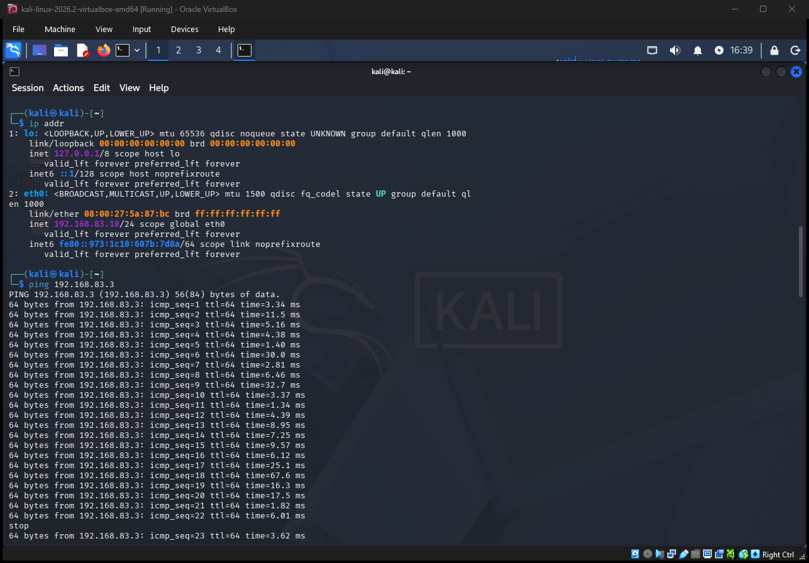
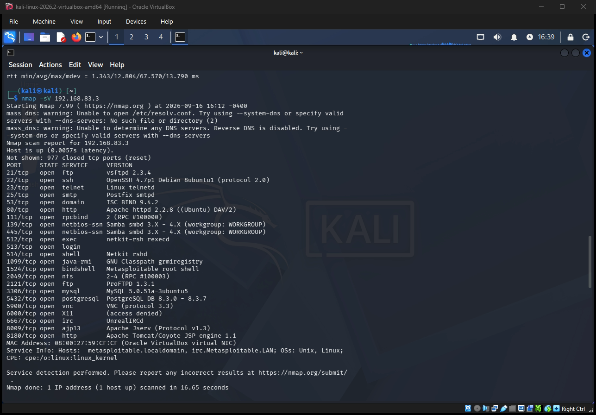
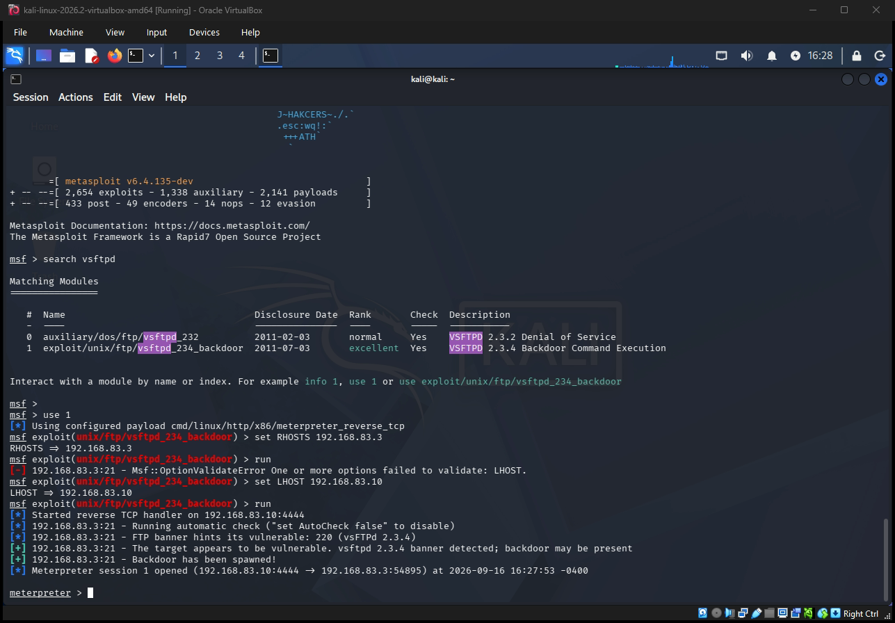
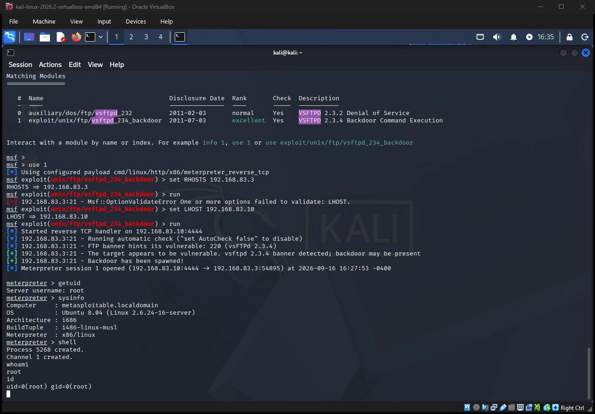
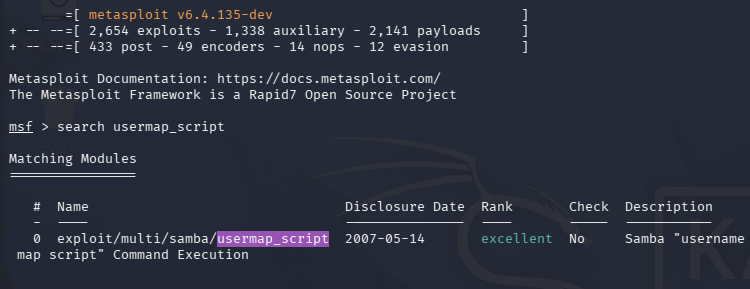
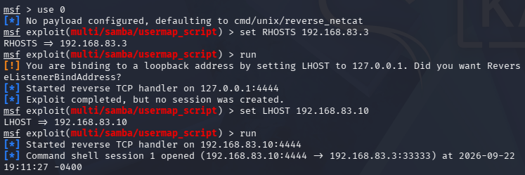
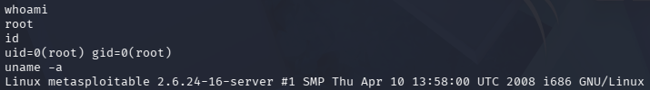

# Cybersecurity Home Lab — Project Documentation

**Author:** Gabriel Kurtz
**Tools used:** VirtualBox 7.2.16, Kali Linux, Metasploitable2, Nmap, Metasploit Framework

## Overview

This project is a small isolated virtual network built to practice core offensive
security skills: network scanning, service enumeration, and exploitation of a
known vulnerability. It simulates a simplified "attacker vs. vulnerable host"
scenario using two virtual machines connected on a private, host-only network.

## Lab Architecture

| VM | Role | OS | IP Address |
|---|---|---|---|
| Kali Linux | Attacker machine | Kali Linux (rolling) | 192.168.83.10 (static) |
| Metasploitable2 | Target machine | Ubuntu-based (intentionally vulnerable) | 192.168.83.3 (DHCP) |

Both VMs were connected via a **VirtualBox Host-only Network**, which isolates
lab traffic from the host machine's real network — nothing here reaches the
public internet or the home network.

## Setup Summary

1. Installed VirtualBox and imported a pre-built Kali Linux VM image.
2. Downloaded and imported Metasploitable2 as the target VM.
3. Created a VirtualBox Host-only Network so both VMs could communicate
   without touching the host's real network.
4. Assigned each VM an IP on that network. Metasploitable2 received one
   automatically via DHCP; Kali was configured with a static IP
5. Verified connectivity between the two VMs with `ping`.

## Step 1: Verify Connectivity

Confirmed both VMs could reach each other before attempting any scanning.

## Step 2: Network Reconnaissance (Nmap)

Ran a service/version detection scan against the target to identify open
ports and running services.

**Analysis:** the scan revealed 23 open services, several of which are known
to be outdated or intentionally vulnerable — notably `vsftpd 2.3.4` on port 21,
which has a publicly documented backdoor vulnerability (CVE-2011-2523).

## Step 3: Exploitation (vsftpd 2.3.4 Backdoor)

Identified and exploited the vsftpd backdoor vulnerability using the Metasploit
Framework.

**Module used:** `exploit/unix/ftp/vsftpd_234_backdoor`

**Result:** successfully gained a Meterpreter shell session on the target
machine by exploiting the vsftpd 2.3.4 command-execution backdoor.

**Verifying access level:**

**Result:** confirmed full root-level compromise of the target — no privilege
escalation was necessary, as this backdoor grants root access directly.

## Step 4: Second Exploit — Samba usermap_script (Command Injection)

To reinforce the recon → exploit → verify workflow, and to demonstrate a second, distinct vulnerability class, the Samba service (ports 139/445) identified in the earlier Nmap scan was also targeted.

Unlike the vsftpd exploit, which relies on an backdoor, this vulnerability is a command injection flaw in how older Samba versions handle the username map script configuration option, allowing arbitrary shell commands to be executed remotely.

Verifying access level:

Result: gained a second, independent root-level command shell on the target — this time via a command injection vulnerability rather than a backdoor, demonstrating a different exploitation technique against a different service.

## Skills Demonstrated
- Virtual network design and isolation (VirtualBox host-only networking)
- Linux network configuration and troubleshooting (static IP assignment, diagnosing DHCP failures, subnet mismatches)
- Network reconnaissance and service enumeration using Nmap
- Vulnerability identification from service/version banners
- Exploitation using the Metasploit Framework (module selection, payload configuration, RHOSTS/LHOST setup)
- Distinguishing between different vulnerability classes (backdoor vs. command injection) and adapting exploitation approach accordingly

## Next Steps
- Add a Windows 10 VM and begin basic Windows networking/firewall exercises
- Set up Windows Server and promote it to a Domain Controller (Active Directory)
- Explore Active Directory attack paths with BloodHound
- Set up Splunk or the ELK stack to log and detect activity from this lab
